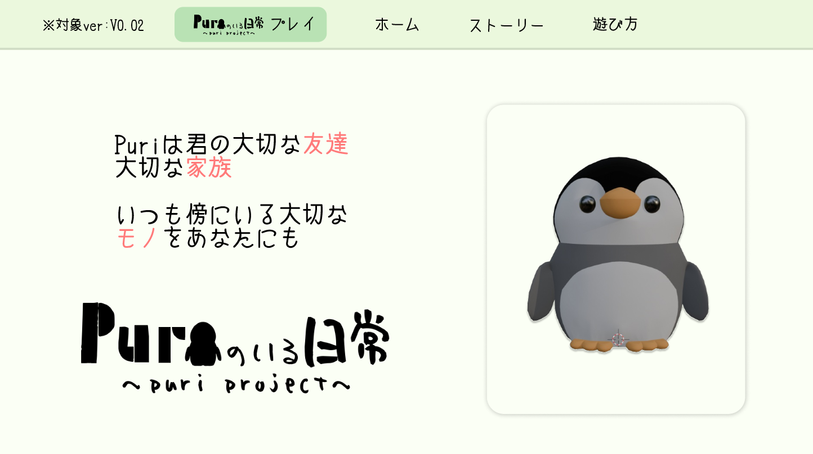
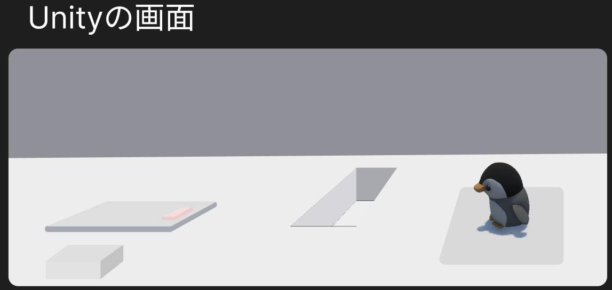
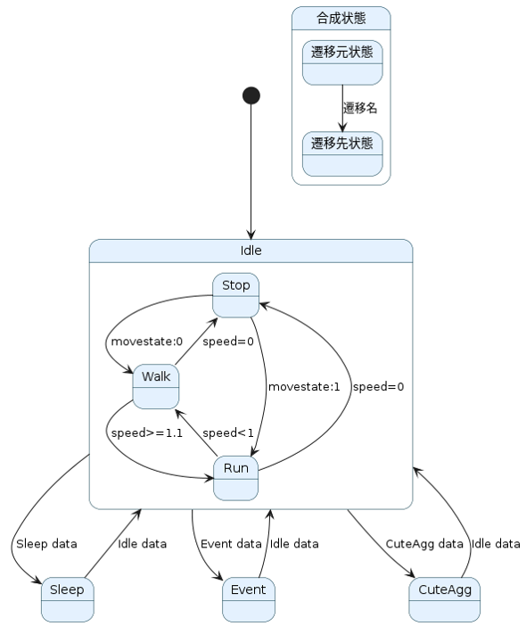
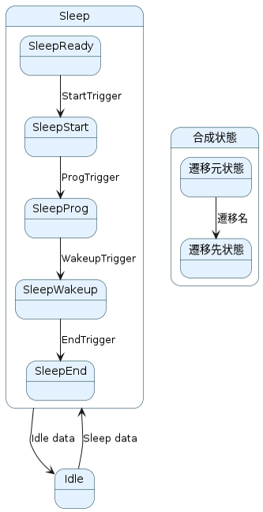
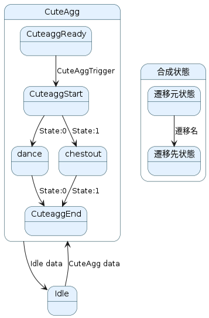
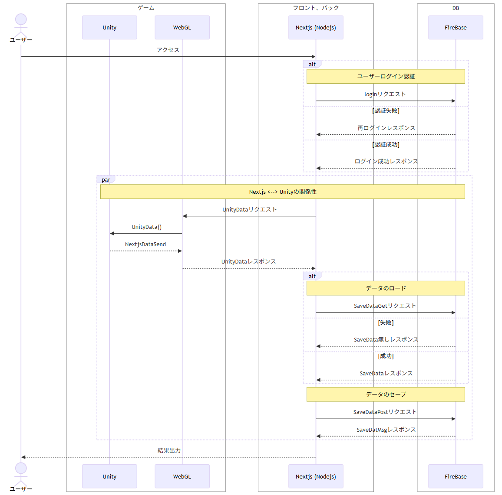

<!-- 制作経緯 -->
# ✍️制作経緯
昔からぬいぐるみが好きで、「ぬいぐるみのようにモデリングされたキャラクターが動いたらいいな」と思ったのがきっかけです。

以前、LOVOT開発企業の代表・林要さんによる著書『温かいテクノロジー』を読みました。この本では、目まぐるしく進化する技術発展や仕事の効率化の波により、日々疲弊している人の現状に触れ、そうした人への「癒し」を目的に開発されたロボットについて語られています。開発者の思考や技術的アプローチなど、UX（ユーザー体験）を重視した開発の姿勢を学び、自分なりに「ストレス社会の中で癒しを提供できる、温かい生き物のような存在」をつくりたいと思い、本制作に取り組みました。

 

<!-- 基本動作 -->
# 🖱️操作方法
**基本的にユーザーが操作することは無く見て楽しむ** 
 
操作内容 
・視点操作(上下制限あり) 
・ズームイン 
・ズームアウト 

<!-- 空白用  -->
 

# 📝プロトタイプ(原案)
Figmaを用いて画面レイアウトや配置などを作成 
ここから→[FigmaのURL](https://www.figma.com/proto/wNxav6Lys1HabwKk09uJOJ/Puri3D_PJ?node-id=39-12&p=f&t=WjQnGn3G4NHqlPzV-1&scaling=contain&content-scaling=fixed&page-id=0%3A1)

 

    
Figma：Nextjsの画面レイアウト

     
     
    
Figma：Unityの画面レイアウト

    

        
    

<!-- 空白用  -->
 

<!-- 設計図 -->
# 🛠️設計図

<h3>UML図について</h3>

GoogleAppsScript(GAS)・スプレッドシートを使用しPlantUML・Mermaidを用いての作成。 
ここから→[PlantUMLのURL](https://docs.google.com/spreadsheets/d/1oGBqyiN7ZvhJDISTy3FTy3aW9RhPgkKS3IOtXvQr0u0/edit?usp=sharing)

<h3>仕様設計書について</h3>

スプレッドシートを使用しUnityで実装予定の機能や状態を簡易的な仕様書を用いての作成。 
ここから→[仕様書のURL](https://docs.google.com/spreadsheets/d/1Pzyacks6uS8ysrEyMfDKb1n_V58ZpnBUDfmrlOC5EBY/edit?usp=sharing)

<!-- 空白用  -->
 

<!-- ゲーム内の状態遷移 -->
 <b>▲ゲーム内の状態遷移</b>
<h3>全体の状態遷移</h3>

ゲーム開始後からIdle状態に遷移し毎フレームで状態チェックを行い該当フラグを検出した際に各Stateに遷移を行う。 
Idle状態ではランダムな位置を設定し移動を行う。速度についても位置指定毎にランダムで設定を行うため 
移動：停止 → 歩き → 停止 / 停止 → 走り → 歩き → 停止 etc 
といった状態をAI側で考えて処理を行う

    

        
    

     
    <h3>各状態遷移</h3>
    

    Sleep状態について 
    Idle状態でランダム遷移するように設定。Sleep状態中は各アニメーションを実行するためのTriggerを設定し睡眠を行う。睡眠時間については値を設定することで長さを変更できる 
    ※ver:0.02.1以降で睡眠時間を調整できるように変更予定 
     
    CuteAgg状態について 
    Idle状態でランダム遷移するように設定。CuteAgg状態中はCuteAggで行いたいアニメーションを選択するためチェック処理を行う。(danceはstate:0など) 
    ただし内容はユーザーが指定するものではなくAI側がランダムで判定した結果を実行することとする。 
    ※ver:0.02.1以降で体調パラメータの追加を行い体調に応じてCuteAggの内容を変化するように変更予定 
     
    Event状態について 
    ver:0.02.1では未実装 
    ※ver:0.02.1以降で実装予定。ユーザーからのアクションを受けた際に遷移するように設定し、puriとのコミュニケーションを行えるようにする状態
    

    

        

        
        
        

    ※上記画像についてはPlantUMLで出力した内容を使用
    

<!-- 空白用  -->
 

<!-- シーケンス図 -->
<b>▲関係性</b>
<h3>全体の関係性について</h3>

ユーザーからの操作はNext → WebGL → UnityといったWebGLを挟む事でゲームの操作を行う形で実装。そのためユーザーへのレスポンスは必ずNext側から結果出力を行う形になっている 
ゲームプレイを行う際は必ずログインを行うように設定。(セーブデータとの紐づけを行う為ログインが必要) 

    

<!-- 空白用  -->
 

<!-- 実装環境 -->
# 💻実装環境

**フロントエンド**
- Nextjs

**バックエンド**
- Nodejs

**コマンド**
- pnpm

**バージョン管理**
- GitHub

**インフラ**
- Vercel

**ゲームエンジン関係**
- Unity
- WebGL(NextjsとUnityのインターフェース)

**3Dモデル作成**
- Blender

**設計書作成**
- GoogleAppsScript(GAS)
- Googleスプレッドシート
- PlantUML
- Mermaid

**プロトタイプ開発**
- Figma

<!-- 空白用  -->
 

<!-- バージョン -->
# 📖履歴・バージョン
2025/1/31 ver:0.01.0 
2025/2/28 ver:0.02.0 
2025/3/28 ver:0.02.1 (稼働中)